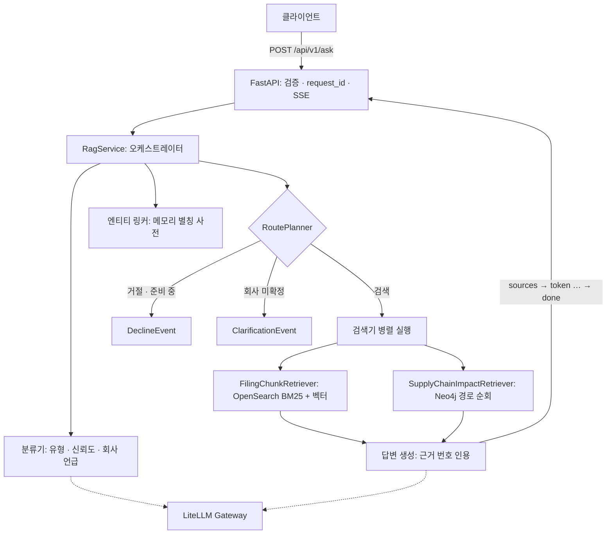
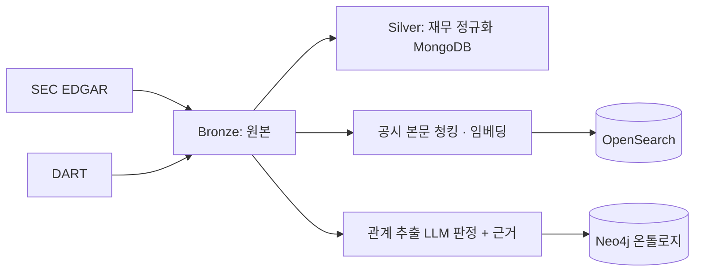
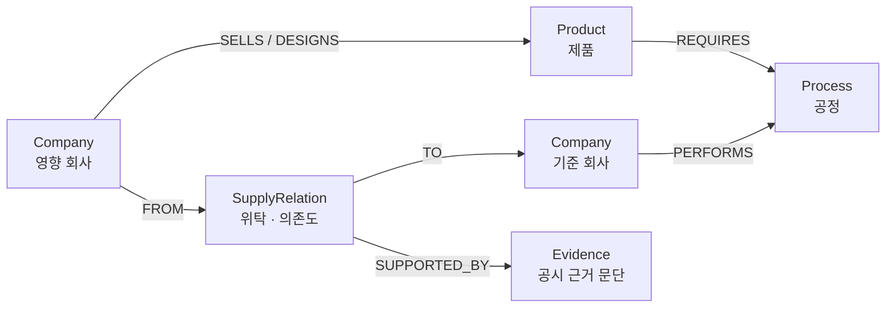

# MIKG: Market Intelligence Knowledge Graph

> 공시 데이터(SEC EDGAR · DART)를 **온톨로지(Neo4j)** 와 **하이브리드 검색(OpenSearch)** 으로 연결해,
> 투자 질문에 **근거가 붙은 답변을 스트리밍**하는 투자 리서치 RAG 엔진

    

---

## 목차

1. [왜 만들었나](#1-왜-만들었나)
2. [무엇을 할 수 있나](#2-무엇을-할-수-있나)
3. [아키텍처](#3-아키텍처)
4. [기술 스택과 선택 이유](#4-기술-스택과-선택-이유)
5. [핵심 설계 결정](#5-핵심-설계-결정)
6. [데이터와 온톨로지](#6-데이터와-온톨로지)
7. [품질 보증](#7-품질-보증)
8. [문제 해결 사례](#8-문제-해결-사례)
9. [개발 방식](#9-개발-방식)
10. [진행 현황과 로드맵](#10-진행-현황과-로드맵)
11. [실행 방법](#11-실행-방법)
12. [디렉터리 구조](#12-디렉터리-구조)
13. [문서](#13-문서)

---

## 1. 왜 만들었나

범용 LLM에게 투자 질문을 하면 세 가지 문제가 반복됩니다.

| 문제 | 예 | MIKG의 접근 |
| --- | --- | --- |
| 근거 없는 답 | "의존도가 높다"고 말하지만 출처가 없음 | 모든 답변에 **공시 원문 근거**를 번호로 연결 |
| 회사 오인 | "삼성"이 삼성전자인지 삼성전기인지 모름 | **엔티티 링킹**으로 회사를 확정하고, 모호하면 되묻기 |
| 관계 추론 불가 | "TSMC가 멈추면 누가 영향받나"에 답하지 못함 | **공급망 그래프**를 순회해 영향 경로를 근거와 함께 제시 |

MIKG는 "답을 대신 내려주는 AI"가 아니라, **더 좋은 정보를 모으고 근거를 구조화해 사용자의 판단을 돕는 시스템**을 목표로 합니다. 그래서 매수 추천·가격 예측 질문은 의도적으로 거절합니다.

---

## 2. 무엇을 할 수 있나

질문을 10가지 유형으로 분류하고, 유형마다 다른 경로로 처리합니다.

| 유형 | 예시 질문 | 처리 | 상태 |
| --- | --- | --- | --- |
| T1 기업 이벤트·실적 요약 | "하닉 2분기 실적 요약해줘" | 공시 하이브리드 검색 → 생성 | ✅ |
| T2 원인 분석 | "삼전 주가 왜 빠졌어?" | 공시 검색 → 생성 | ✅ |
| T3 공급망 영향 경로 | "TSMC 차질 나면 어디가 영향 받아?" | **그래프 순회 + 공시 검색** → 생성 | ✅ 검색기 완료, 분류기 연결 중 |
| T4 정형 지표 비교 | "삼전 vs 하닉 영업이익률" | 정형 DB 조회 → 표 + 해설 | 🔜 |
| T5·T6·T9·T10 | 매크로 해석, 개념 설명, 스크리닝, 가설 검증 | 준비 중 안내 | 🔜 |
| T7 매수 추천·가격 예측 | "엔비디아 지금 사도 돼?" | **거절** (판단 근거 제공 방향 안내) | ✅ |
| T8 범위 밖 | "점심 뭐 먹지?" | 거절 | ✅ |

**회사 인식**

- 별칭·티커·옛 사명 사전 매칭: "삼전", "SK 하이닉스", "NVDA실적", "Broadcom Inc."
- 오타·별명 보정 (LLM 추정 + 사전 확정): "마이크런" → Micron, 보정 사실을 사용자에게 알림
- 모호하거나 여러 회사면 **되묻기**, 사용자가 고른 회사로 재요청

---

## 3. 아키텍처

### 요청 흐름



### 데이터 파이프라인



### 계층과 의존 방향

```
api → orchestration → generation / retrieve / entity_linking / classification → schemas
```

역방향 import를 금지하고, 계약(DTO · 이벤트 · enum)은 `schemas`에 한 번만 정의합니다.

---

## 4. 기술 스택과 선택 이유

| 영역 | 기술 | 선택 이유 |
| --- | --- | --- |
| API | FastAPI, SSE (`StreamingResponse`) | 토큰 단위 스트리밍, 비동기 I/O |
| 그래프 | Neo4j (비동기 드라이버) | 공급망 다단계 관계 순회, 관계별 근거·신뢰도 저장 |
| 검색 | OpenSearch (BM25 + 벡터 하이브리드) | Apache 2.0 라이선스, ES 호환 쿼리 DSL |
| 정형 데이터 | MongoDB (Bronze/Silver) | 공시 재무 원본 보존 + 정규화 계층 분리 |
| LLM 게이트웨이 | LiteLLM Proxy (별도 저장소) | 모델 별칭으로 용도별 분리(답변·분류·별칭 생성·임베딩), 비용 추적 |
| 검증 | Pydantic v2 | DTO 불변식(상태 ↔ 결과 개수), 구조화 출력 검증 |
| 패키지 | uv | 빠른 의존성 관리, 재현 가능한 환경 |
| 테스트 | pytest (단위 / 통합 마커 분리) | 외부 의존 없는 기본 테스트 + 실DB 통합 테스트 |

---

## 5. 핵심 설계 결정

| 결정 | 이유 |
| --- | --- |
| **미지원 유형도 분류 체계에 명시** (T5~T10) | 분류기는 닫힌 집합이라, 미지원 유형이 없으면 가장 가까운 지원 유형으로 억지 분류함 |
| **판단(plan)과 실행 분리** | `RoutePlanner`는 순수 판단 객체라 표 기반 테스트로 모든 분기를 고정. 유형별 검색기 조합도 분기문이 아닌 **표**로 관리 |
| **거절·되묻기를 검색·LLM 앞에서 처리** | 불필요한 검색·생성 비용 0, "회사를 되묻고 나서 거절"하는 UX 방지 |
| **사전 매칭 + LLM 추정의 하이브리드 링킹** | LLM은 "회사 언급 추출"까지, ID 확정은 항상 카탈로그 대조. LLM의 회사 추측이 그대로 답변에 쓰이는 사고 방지 |
| **별칭 충돌 시 양쪽 모두 제외** | 먼저 들어온 회사가 가져가면 데이터 순서에 따라 조용히 오링킹 |
| **위탁 관계를 엣지가 아닌 노드로** (SupplyRelation) | 관계 하나에 근거(Evidence) 여러 개를 연결하기 위해 |
| **경로 점수 = 가장 약한 관계의 신뢰도** | 사슬은 가장 약한 고리만큼만 신뢰 가능 |
| **doc_id는 도메인 ID로 구성** | Neo4j 내부 ID는 재적재 시 바뀌어 평가 골든셋의 정답 키로 쓸 수 없음 |
| **에러도 이벤트로** (`done` 또는 `error`로 종료) | 스트림이 시작되면 이미 200을 보냈으므로 상태 코드로 실패를 알릴 수 없음 |
| **분류 실패 시 T1 폴백** | 보조 단계 실패로 답변 전체가 막히지 않게. 짧은 타임아웃 + 재시도 최소 |
| **비동기 서버 / 동기 ETL 드라이버 분리** | 비동기 드라이버는 이벤트 루프에 묶이므로 서버 수명주기(lifespan)가 생성·종료를 소유 |

---

## 6. 데이터와 온톨로지

### 그래프 모델



- **경로 A (공정 경유)**: TSMC → CoWoS 공정 → GPU → NVIDIA·AMD
- **경로 B (위탁 관계)**: Broadcom → (웨이퍼 제조 위탁, 의존도 95%) → TSMC

### 근거 신뢰도 체계

| 값 | 의미 | 예 |
| --- | --- | --- |
| `disclosed` | 관계 + 수량이 공시에 명시 | "approximately 95% of the wafers … produced by TSMC" |
| `stated` | 관계만 서술, 수량 없음 | "We utilize foundries, such as TSMC, and Samsung" |
| `inferred` | 다른 사실에서 파생 | 위탁 관계에서 생성한 공정 노드 |

**원칙**: 값은 그 레코드에 붙은 근거가 증명하는 만큼만 넣는다. 사실이어도 근거 문장에 수량이 없으면 `stated` + 수치 없음.

### 현재 데이터 규모

| 항목 | 규모 |
| --- | --- |
| 재무 데이터 (Silver, EDGAR + DART) | 약 7만 건 |
| 링킹 대상 회사 | 13개사 (반도체 밸류체인) |
| 제품 관계 (SELLS / DESIGNS) | 61 / 56 |
| 위탁 관계 (SupplyRelation) | 4 |
| 근거 문단 (Evidence) | 18 (샘플) |

---

## 7. 품질 보증

### 테스트 구성

| 구분 | 대상 | 방식 |
| --- | --- | --- |
| 단위 | 별칭 인덱스, 매칭, 링커, 분류 변환, planner, RagService, API 스트리밍, 그래프 결과 매핑 | 가짜 의존성(링커·검색기·생성기·LLM 클라이언트) 주입, DB·LLM 없이 실행 |
| 통합 (`-m integration`) | 실데이터 링킹 스모크, 공급망 검색기 | 실제 Neo4j. 값이 아닌 **불변 조건**(정렬·중복·자기 자신 제외)을 단언 |
| 데이터 품질 | `disclosed` 근거에 수량 표현 존재 | 발견한 데이터 오류의 재발을 테스트로 고정 |

```bash
uv run pytest -q                  # 단위 (외부 의존 없음)
uv run pytest -m integration -q   # 통합 (Neo4j 필요)
```

### 검색 품질 베이스라인

| 지표 | 값 |
| --- | --- |
| Hit Rate@K | 1.000 |
| Recall@K | 0.753 |
| Precision@K | 측정 예정 |
| MRR | 0.800 |
| nDCG@K | 0.710 |

> 골든셋 5문항 기준의 초기 베이스라인입니다. 질문 유형별 골든셋 확장 후 재측정 예정입니다.

---

## 8. 문제 해결 사례

### 사례 1: "NVIDIA는 TSMC에 100% 의존"이라는 근거 없는 수치

- **발견**: 공급망 검색기 통합 테스트 출력을 직접 읽다가, NVIDIA 위탁 관계가 `의존도 100%, disclosed`인데 근거 문장은 "such as TSMC, and Samsung"(수치 없음, 다른 공급사 병기)인 것을 확인
- **원인**: 적재 단계의 LLM 판정이 근거에 없는 수치를 생성
- **조치**
  1. 데이터 정정 3건 (수정 이력 `corrected_at`, `correction_note` 기록)
  2. "disclosed 근거에는 수량 표현이 있어야 한다"를 **데이터 품질 테스트로 고정**
  3. 근본 원인(판정 규칙)을 백로그 최우선으로 등록
- **배운 점**: 쿼리로 틀린 데이터를 가리지 않는다. 데이터가 틀리면 데이터를 고치고, 재발을 테스트로 막는다

### 사례 2: 같은 이름, 다른 의미의 속성이 만든 역방향 버그

- **현상**: "파생 관계 제외" 조건을 넣었는데, 오히려 근거 있는 경로가 빠지고 파생 경로가 남음
- **원인**: Process 노드의 `derived_from`은 "파생 원천", PERFORMS 엣지의 `derived_from`은 "출처 문서 종류"로 **같은 이름이 다른 의미**
- **조치**: 조건을 "근거 등급이 있는 관계만"으로 변경, 스키마 확인 쿼리로 전제 검증, 속성명 통일을 백로그로
- **배운 점**: 쿼리 조건에 쓰는 순간 속성의 의미가 계약이 된다. 전제는 추정하지 말고 데이터로 확인한다

### 사례 3: 스트리밍 응답의 실패 처리

- 스트림 중 LLM 게이트웨이 연결 실패 시, 내부 예외 메시지를 노출하지 않고 `error` 이벤트 + `request_id`로 종료
- 클라이언트 연결이 끊기면 안쪽 LLM 스트림까지 즉시 닫아 비용·연결 누수 방지

---

## 9. 개발 방식

### 작업 절차

모든 기능은 **작업정의서(목적·범위·제외·스키마) → 플로우차트 → 태스크 → 코드 → 검증** 순서로 진행합니다.

### 설계 하네스

AI 페어 프로그래밍 환경에서 설계 품질을 유지하기 위해, 검증 가능한 규칙으로 하네스를 정의해 적용했습니다.

| 규칙 | 내용 |
| --- | --- |
| 함수 vs 클래스 | 설정값·분기 증가·구현 교체·외부 연결이 로드맵에 있으면 처음부터 클래스, 설계안에 선택 근거 한 줄 필수 |
| 의존성 주입 | DB·API·LLM·설정을 가진 객체는 생성자 주입, 순수 로직은 함수 |
| 진입점 입력 | 서비스 진입점은 처음부터 요청 DTO 하나로 (확정된 추가 입력은 필드로 미리 포함) |
| 추정 금지 | 의존하는 기존 코드를 먼저 확인하고, 모르면 추정하지 않는다 |
| 변경 영향 | 설계 변경 시 영향받는 파일·테스트 목록을 먼저 제시 |
| 검증 | 태스크마다 실행 명령 + 기대 결과 |

> 하네스는 실제로 발생한 문제(DTO 중복 정의, 이벤트 필드명 불일치, 함수로 시작했다가 클래스로 바꾼 리팩토링 등)를 규칙으로 바꾼 것입니다.

---


## 11. 실행 방법

### 사전 준비

- Python 3.12, [uv](https://docs.astral.sh/uv/)
- Docker (Neo4j, OpenSearch)
- LLM 게이트웨이 (`mikg-llm-gateway` 저장소, LiteLLM Proxy)

### 설치

```bash
uv sync
cp .env.example .env   # 값 채우기
```

### 주요 환경변수

| 변수 | 용도 |
| --- | --- |
| `NEO4J_URI`, `NEO4J_USER`, `NEO4J_PASSWORD` | 그래프 DB |
| `OPENSEARCH_HOST`, `OPENSEARCH_PORT` | 검색 |
| `CLASSIFIER_MODEL`, `CLASSIFIER_TIMEOUT_SECONDS`, `CLASSIFIER_MAX_RETRIES` | 질문 분류 |
| `CLASSIFIER_MIN_CONFIDENCE` | 이 값 미만 분류는 T1로 처리 |
| `ALIAS_MIN_ALPHANUM_LEN` | 짧은 영문 별칭 제외 기준 |
| `SUPPLY_CHAIN_IMPACT_MAX_PATHS` | 공급망 영향 경로 최대 수 |
| `ASK_QUESTION_MAX_LENGTH` | 질문 최대 길이 |
| `LOG_LEVEL` | 로그 레벨 |

### 실행

```bash
# 서버 (앱 모듈 경로는 프로젝트 구조에 맞게)
uv run uvicorn market_intelligence_knowledge_graph.main:app --port 8000
```

```bash
# 질문
curl -N -X POST http://localhost:8000/api/v1/ask \
  -H "Content-Type: application/json" \
  -d '{"question":"삼전 최근 리스크 요약해줘"}'
```

### 응답 예시 (SSE)

```
event: sources
data: {"sources":[{"index":1,"doc_id":"...","entity_id":"dart:00126380","section_title":"...","content":"...","score":0.92}]}

event: token
data: {"text":"삼성전자의 주요 리스크는 "}

event: done
data: {}
```

---

## 12. 디렉터리 구조

```
src/market_intelligence_knowledge_graph/
├── api/                 # HTTP 계층: 요청 검증, SSE 변환, 스트리밍 에러 처리, request_id, 버전 라우터
├── config/              # 설정 로더 (.env, 기동 시 검증)
└── rag/
    ├── schemas/         # 계약: 이벤트, 요청 DTO
    ├── classification/  # 질문 유형 분류 (LLM, 스텁, 프롬프트)
    ├── entity_linking/  # 별칭 인덱스, 매칭, 로더, 링커
    ├── retrieve/        # 검색기: 공시 청크, 공급망 영향
    ├── generation/      # 컨텍스트 구성, 답변 생성, 게이트웨이 클라이언트
    └── orchestration/   # RagService, RoutePlanner
```

---

## 13. 문서

| 문서 | 내용 |
| --- | --- |
| `docs/ontology-schema.md` | Neo4j 노드·관계·속성, 신뢰도 체계, 서빙 쿼리 규칙, 변경 이력, 알려진 이슈 |
| `docs/cost-optimization.md` | LLM 비용 절감 프로세스, 방법 카탈로그, 품질 게이트, 적용 계획 |

---


---

